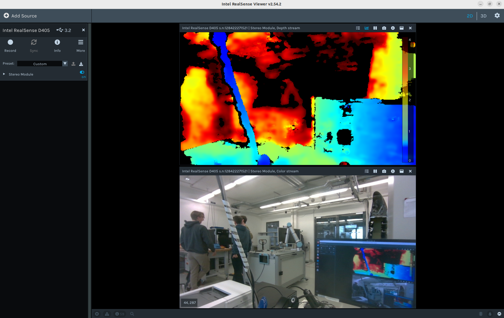
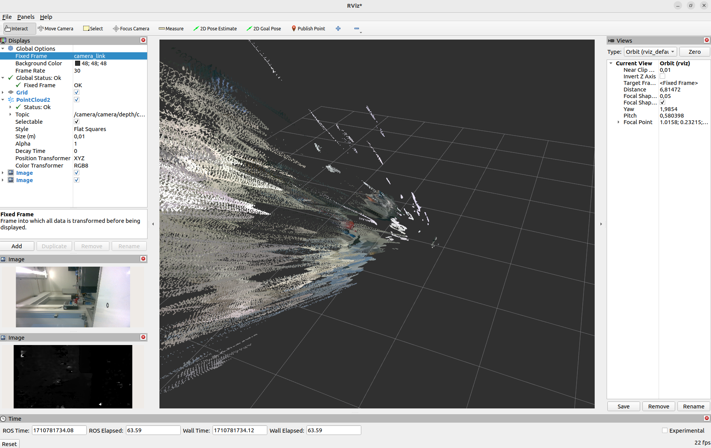
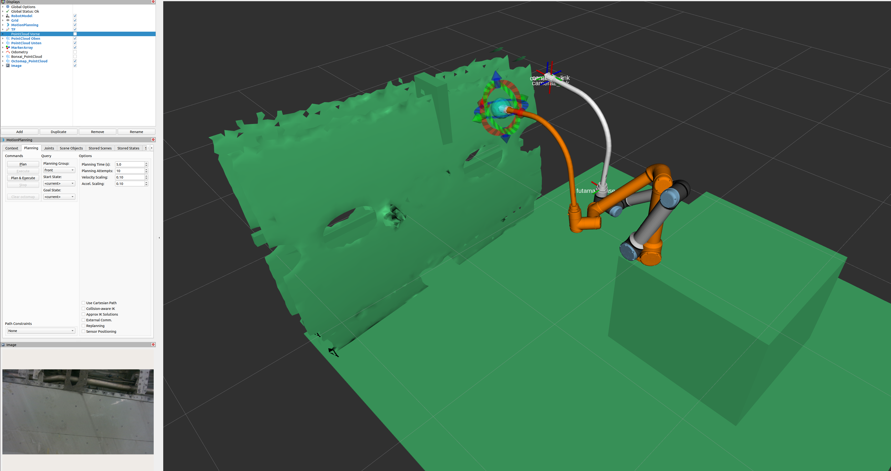
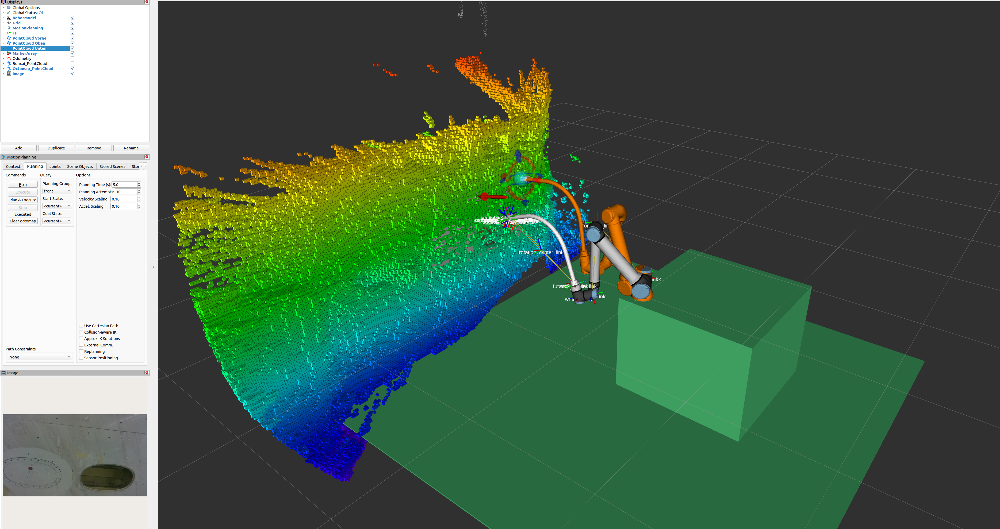
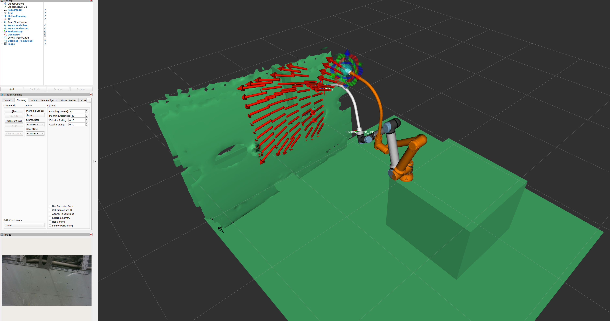
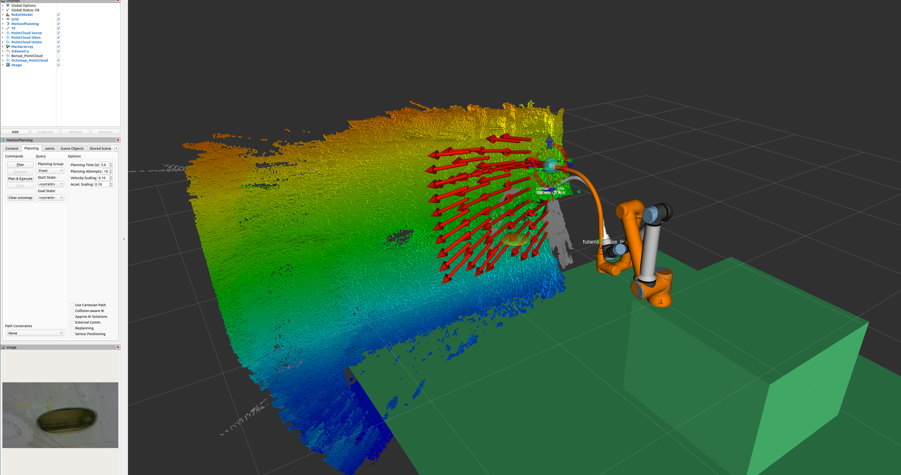
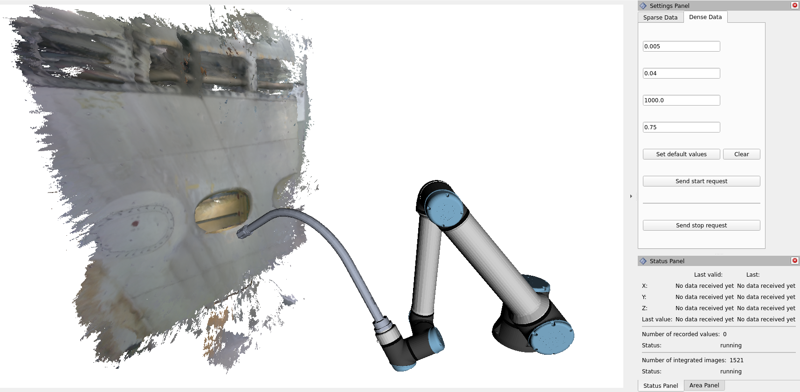
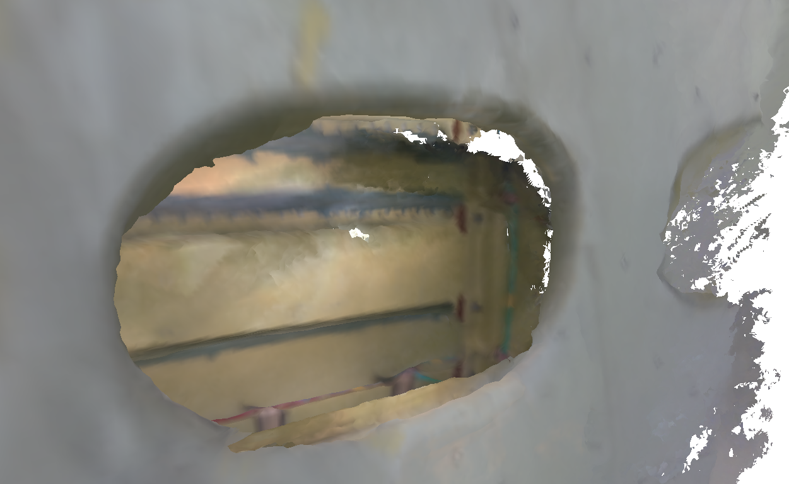

<!--
SPDX-FileCopyrightText: 2024 German Aerospace Center <adrian.ricardezortigosa@dlr.de>

SPDX-License-Identifier: MIT
-->

# FuTaMa2 Project
## (Fuel Tank Maintenance 2)

The aim of this project is to provide the [Robot-Assisted-Inspection-and-Repair](https://wiki.dlr.de/display/MO/Robot.Assisted+Repair) team of the [German Space Center (DLR) - Maintenance, Repair and Overhaul Institute (MO)](https://www.dlr.de/en/mo) and the community of robotic inspection using a set of hardware and software tools using [ROS2](https://docs.ros.org/en/rolling/Installation.html). This will help to explore the challenges of manual inspection and automatic inspection methods performed by the integrated system: UR10e robotic arm + Eeloscope2 (sucessor of [Eeloscope1](https://www.mdpi.com/2226-4310/8/5/136)), which feature 3 RGB-D cameras and 6 LEDs on its end effector. Since there exists not much open-source documentation about these topics, this project was proposed to fill that research gap and to encourage modular and continuous research. The potential contribution to the audience is to enable technology transfer possibilities to other systems using known packages such as Moveit2, Octomap, and Realsense, as a reference framework.

The use case utilized in this study was the inspection of a aircraft wing fuel tank (Boeing 737-700).
A research article with the methodology, analysis, approach and results of the experiments is intended to be published soon on the [MDPI Open Access Journal](https://www.mdpi.com/). 

Developed packages of this repo:
1. [futama2_description](futama2_robot/futama2_description/) -> urdf, IP, and controllers setup, robot state publisher, STL, meshes, ...
2. [futama2_moveit_config](futama2_robot/futama2_moveit_config/) -> config for moveit and planning scene
3. [futama2_teleop](futama2_robot/futama2_teleop/) -> demo of manual and automatic teleoperations, foto capturing, higher-level functions for robotic inspection
4. [futama2_utils](futama2_robot/futama2_utils/) -> utilities (so far only one for the moveit planner)

A high-level overview can be graphically summariyed with the following picture:


## Table of Contents

- [Preparation and Recommendations](#preparation-and-recommendations)
- [Installation of Packages](#installation-of-packages)
  1. [Realsense-ROS](#1-realsense-ros)
  2. [Moveit2 packages](#2-moveit2)
  3. [Universal Robots](#3-universal-robots)
  4. [ Octomap](#4-octomap)
  5. [Spacenav](#5-spacenav)
  6. [RTABmap](#6-rtab-map-not-required-but-todo)
  7. [FuTaMa2](#7-futama2-from-source)
  - [Docker](#docker)
- [Robot Usage](#robot-usage)
- [Maintainers](#maintainers), [Contributing](#contributing) & [License](#license)

## Preparation and Recommendations

- Install the [ROS2 Rolling](https://docs.ros.org/en/rolling/Installation.html) distro for [Ubuntu 22.04 LTS Jammy](https://releases.ubuntu.com/jammy/)
- Install [Terminator](https://wiki.ubuntuusers.de/Terminator/)
- Follow the [ROS System Setup basics](https://wiki.dlr.de/display/MO/ROS+System+Setup) (if you have access to the DLR wiki)
- Install Visual Studio [Code](https://code.visualstudio.com/docs/setup/linux) and its extensions: ROS2, Python, C++, Git, CMake.
- Prepare git, e.g. add a [ssh-key](https://docs.github.com/en/authentication/connecting-to-github-with-ssh/adding-a-new-ssh-key-to-your-github-account) to your git account.
- Follow the fundamental ROS2 [tutorials](https://docs.ros.org/en/rolling/Tutorials.html), e.g. how to [build from source](https://docs.ros.org/en/eloquent/Installation/Linux-Development-Setup.html), how to search and install/uninstall binaries (`apt search ros-$ROS_DISTRO-<package_name>`, `sudo apt install ros-$ROS_DISTRO-<package_name>`, `sudo apt remove ros-$ROS_DISTRO-<package_name>`)
- How to use the `--symlink-install` [argument](https://answers.ros.org/question/371822/what-is-the-use-of-symlink-install-in-ros2-colcon-build/) when building from source, especially if one will mantain python code such as launch files or scripts.
- Generally, on each repo, the main mantainer will explain the installation steps for their package (e.g. usually one needs to [manage dependencies](https://docs.ros.org/en/foxy/Tutorials/Intermediate/Rosdep.html) and maybe other additional steps.

### Mini-Tutorial linking and building packages in the workspace (ws):

1. In the Home directory, create a folder named git, where all cloned packages will be.
2. Again in Home, create a new [workspace](https://docs.ros.org/en/rolling/Tutorials/Beginner-Client-Libraries/Creating-A-Workspace/Creating-A-Workspace.html) (in this case it could be called e.g. "futama2_ws" for ROS2 convention). 
3. After cloning packages with [git commands](https://git-scm.com/docs), one can link these packages to the ws with `ln -s ~/git/<package_directory_name> ~/futama2_ws/src/`
4. Ready to resolve dependencies and build packages as explained above, continue to the next section.

# Installation of Packages
## 1. Realsense-ROS

Packages that will manage the connection and usage of the Intel Realsense depth cameras. In this project, the [D405](https://www.intelrealsense.com/depth-camera-d405/) and [D435i](https://www.intelrealsense.com/depth-camera-d435i/) (without using the internal IMU) were tested out.

Required binaries:

- [Here the instructions](https://github.com/IntelRealSense/librealsense/blob/master/doc/distribution_linux.md#installing-the-packages) for installing the [librealsense](https://github.com/IntelRealSense/librealsense) (SDK) package (["Step2-Option1-Linux Debian Installation"](https://github.com/IntelRealSense/realsense-ros)), since one could encounter multiple issues if building from source (not recommended).

- Other possible required binary packages: [xacro](https://github.com/ros/xacro/tree/ros2), [diagnostic_updater](https://github.com/ros/diagnostics), [launch_pytest](https://github.com/ros2/launch)

Building from source:

- The ros2-development branch of the [wrapper](https://github.com/IntelRealSense/realsense-ros), (["Step3-Option2-Install"](https://github.com/IntelRealSense/realsense-ros)).

- Since the rosdep can't resolve the librealsense installed binaries, it is recommended to build from source the development branch of the [librealsense](https://github.com/IntelRealSense/librealsense/tree/development) package too.

Troubleshooting:
1. Issues [#1225](https://github.com/IntelRealSense/librealsense/issues/1225) and [#10988](https://github.com/IntelRealSense/librealsense/issues/10988) can be avoided by disabling the [Secure Boot](https://wiki.ubuntu.com/UEFI/SecureBoot/DKMS) (only if you present this error, otherwise, ignore this bullet point).

2. Other problems when [building](https://docs.ros.org/en/rolling/Installation/Alternatives/Ubuntu-Development-Setup.html) might be related to USBs (kernel) or binary installation (debian packages). One can solve them by simply search the log output on the web.

3. Be aware of the manual plug / unplug of the cameras when following the installation steps. Sometimes one might make mistakes and require to start over again.

### Quick camera test

- One should now be able to open the Realsense Viewer with `realsense-viewer`, which will serve for us just as an installation checker.
- All documentation about calibration can be found in: [Overview](https://dev.intelrealsense.com/docs/calibration), [Tunning Best Performance](https://dev.intelrealsense.com/docs/tuning-depth-cameras-for-best-performance) (execute the Depth Quality Tool with `rs-depth-quality`), [Self-Calibration](https://dev.intelrealsense.com/docs/self-calibration-for-depth-cameras) (the On-Chip Calibration only considers exstrinsic parameters), and the [Dynamic Calibration Tool](https://www.intel.com/content/www/us/en/download/645988/intel-realsense-d400-series-dynamic-calibration-tool.html) (open with `usr/bin/Intel.Realsense.DynamicCalibrator`).



Troubleshooting:

4. If an error about "GLFW Driver Error" [#8661](https://github.com/IntelRealSense/librealsense/issues/8661) rises when opening the realsense-viewer, restarting the computer can fix this.

### Quick launch test

- After building the workspace, one should now be able to test the main launch file with:

`ros2 launch realsense2_camera rs_launch.py pointcloud.enable:=true align_depth.enable:=true`

and visualize the topics on ```rviz2```. The four most useful topics are:

- /camera/camera/color/camera_info
- /camera/camera/color/image_rect_raw
- /camera/camera/depth/image_rect_raw
- /camera/camera/depth/color/points



For more information please consult the official RealSense [usage](https://github.com/IntelRealSense/realsense-ros?tab=readme-ov-file#usage) section.

## 2. Moveit2
Packages that enable robotic manipulation featuring motion planning, 3D perception, kinematics, etc. Official documentation [here](https://moveit.picknik.ai/main/index.html).

Required binaries:
- osqp_vendor, ament-cmake-google-benchmark, stomp, ros_testing

Build from source:
- [Moveit2](https://moveit.ros.org/install-moveit2/source/). The generated packages need to be linked from git directory to the ws: moveit2, moveit_msgs, moveit_resources, moveit_visual_tools, generate_parameter_library.

- The moveit2_tutorials to test the packages functionalities can also be tested following these [instructions](https://moveit.picknik.ai/main/doc/tutorials/getting_started/getting_started.html).

Dependencies not resolved -> urdfdom and urdfdom_headers are installed automatically but not recognized by moveit, are they important?

## 3. Universal Robots
ROS2 manipulator drivers for the lightweight UR robotic manipulators.

Required binaries: only the "ur_msgs" package. The rest of the binaries for Rolling seem to be in "passing" phase, but it will be better to do it from source.

Build from source: 
- ros2 branch from [moveit_visual_tools](https://github.com/moveit/moveit_visual_tools)
- main branch from [Universal_Robots_ROS2_Driver](https://github.com/UniversalRobots/Universal_Robots_ROS2_Driver.git)
- rolling branch from [Universal_Robots_ROS2_Description](https://github.com/UniversalRobots/Universal_Robots_ROS2_Description)
- master branch from [Universal_Robots_Client_Library](https://github.com/UniversalRobots/Universal_Robots_Client_Library)

Please follow the how-to-setup-the-connection [instructions](https://docs.ros.org/en/ros2_packages/rolling/api/ur_robot_driver/installation/robot_setup.html) between external computer and the UR10e robot to link and test the hardware.

## 4. Octomap
The [Octomap](https://octomap.github.io/) is an efficient probabilistic 3D Mapping framework Based on [Octrees](https://en.wikipedia.org/wiki/Octree). This stack helps for mapping/voxelizing the environment, which helps for the obstacle avoidance functionality when performing the motion planning from Moveit2.

Required binaries:
- octomap, octomap-ros, octomap-server, octomap-mapping, octomap-msgs, octomap-rviz-plugins

## 5. Spacenav
[Package](https://index.ros.org/p/spacenav/) required to control de 6 DoF [Spacemouse](https://3dconnexion.com/de/product/spacemouse-compact/)

Required binaries: spacenav
- Quick test: Visualize the topics by running the node with `ros2 run spacenav spacenav_node` 

## 6. RTAB-Map (not required, but TODO)

Binaries required that might not be satisfied when resolving dependencies: velodyne, behaviortree_cpp, octomap_server. Installed but not recognized (TO CHECK): libpointmatcher.

The [rtabmap-ros](https://github.com/introlab/rtabmap_ros/tree/ros2) package is a [wrapper](https://roboticsbackend.com/create-a-ros-driver-package-introduction-what-is-a-ros-wrapper-1-4/) of [RTAB-Map](http://introlab.github.io/rtabmap/)(Real-Time Appearance-Based Mapping). It is a powerful Stereo and Lidar Graph-Based [SLAM](https://de.wikipedia.org/wiki/Simultaneous_Localization_and_Mapping) (Simultaneous Localization and Mapping) approach based on an incremental appearance-based loop closure detector. In other words, it maps the surroundings using a camera's RGB-D data.

- Dependencies: follow the instructions for building from source on [grid_map](https://github.com/ANYbotics/grid_map/tree/rolling) (here, the nav2 packages will also take place), [slam_toolbox](https://github.com/SteveMacenski/slam_toolbox), and [RSL](https://github.com/PickNikRobotics/RSL)

- Follow the installation from source from the official [rtabmap_ros](https://github.com/introlab/rtabmap_ros/tree/ros2) repo. When rgbd_cameras>1 (multi-RGB-D cameras), it is recommended for building:

```colcon build --symlink-install --cmake-args -DRTABMAP_SYNC_MULTI_RGBD=ON -DRTABMAP_SYNC_USER_DATA=ON -DCMAKE_BUILD_TYPE=Release```

Quick Troubleshooting: TODO STILL NOT WORKING THE TF2-GEOMETRY-MSGS

- You might need to install some extra dependencies which couldn't be resolved. Simply type ```sudo apt install ros-$ROS_DISTRO-<package_name>``` (with minus symbol "-" instad of underscore "_") e.g. ```sudo apt install ros-$ROS_DISTRO-pcl-ros```, being the package name, such as pcl_ros, rviz_default_plugins, etc.. and then build the workspace again until it's 100%. The tf2_geometry_msgs package might be required to be removed and installed with "get": ```sudo apt-get install ros-$ROS_DISTRO-tf2-geometry-msgs```

## 7. FuTaMa2 from Source
Once all previous packages are installed / linked in the ws, then do:
- `cd ~/git`
- `git clone https://github.com/DLR-MO/futama2`
- `ln -s ~/git/FuTaMa2/futama2_robot ~/futama2_ws/src`
- `cd ~/futama2_ws`
- `rosdep update && rosdep install -r -y --from-paths . --ignore-src --rosdistro $ROS_DISTRO -y` (check that most of dependencies are resolved)
- `colcon build --symlink-install --cmake-args -DCMAKE_BUILD_TYPE=Release`
- Ideally, the robot should now be operational!

## Docker

Will be done in the coming weeks. The installation steps were already followed and they work, but a docker and a .repos file can be added to enable a more ergonomic installation.

# Robot Usage

## Hardware Preparation
The setup shown in [this](#futama2-project) diagram is needed for the robot to work properly (for mock and real environments). If the spacemouse is not available, the robot can still be operational with the keyboard, but the foto capture becomes a little bit trickier. The best is to have the complete setup ready.

## Main Commands for Experiments

Three main commands that are executed together in separate terminals:
1. Teleop Launch: `ros2 launch futama2_teleop teleop.launch.py mode:=<mode> camera_mdl:=<camera_mdl> multicam:=<multicam> insp_mode:=<insp_mode> spacemouse:=<spacemouse> octomap:=<octomap>`
2. Keyboard Node (required only in manual teleoperation, always with or without the spacemouse): `ros2 run futama2_teleop keyboard_node`
3. For enabling auto exposure `ros2 param set /camera/camera depth_module.enable_auto_exposure true`

Arguments for the main command:
- mode (robot): **mock** (default) / **real** / **sim** (o3de) / **urdf** (TODO)
- camera_mdl (tested cameras): **d405** (default at the lab) / **d435i** (e.g. for debugging at home)
- multicam (single or 3xcam): **false** (default) / **true**
- insp_mode (inspection mode): **manual** (default) / **automatic**
- spacemouse (spacemouse availability): **false** (default) / **true**
- octomap (obstacle avoidance): **false** (default) / **true**

### 1. Mock Manual Teleoperation with Keyboard / Spacemouse (optimized modules - debugging)

This experiment helps on the understanding of the packages, and the robot's functionalities and training of the personnel during inspection tasks (debugging at home e.g. with a D435i camera instead of a D405). Considering that an average laptop is used, multicam session and octomap are disabled to reduce the load in the CPU.

Steps:

1. Terminal 1 (edit spacemouse if available): `ros2 launch futama2_teleop teleop.launch.py mode:=mock camera_mdl:=d435i multicam:=false insp_mode:=manual spacemouse:=false octomap:=false`
2. Terminal 2: `ros2 run futama2_teleop keyboard_node`
3. Since the forward_position_controller cannot respond to immediate commands at the beginning of the node, one needs to command the current controller (joint_trajectory_controller) once by moving the Query Goal State (orange robot, interacting with the sphere marker) to a simple position (not so different from the original one) and then pressing the Plan & Execute button in the MotionPlanning plugin on the left in Rviz.
4. Once the robot successfully moved with the moveit planner, Terminal 2 is now ready to change controllers (follow the instructions shown there, starting with the Joint mode!) and teleoperate the robot with the keyboard / spacemouse or to change it back to the joint_trajectory_controller and plan and execute with the MotionPlanning plugin.
5. Terminal 3: once can take "screenshots" of the stamped camera images by pressing both side buttons. If the spacemouse is not available, this function has to be simulated by publishing the following to the /spacenav/joy topic:
- `ros2 topic pub --once /spacenav/joy sensor_msgs/Joy \ '{ header: { stamp: 'now', frame_id: "realsense_center_link"}, axes: [0.0, 0.0, 0.0, 0.0, 0.0, 0.0], buttons: [1, 1]}'`
- `ros2 topic pub --once /spacenav/joy sensor_msgs/Joy \ '{ header: { stamp: 'now', frame_id: "realsense_center_link"}, axes: [0.0, 0.0, 0.0, 0.0, 0.0, 0.0], buttons: [0, 0]}'`
- The picture should be now saved then in your workspace.



### 2. Real Manual Teleoperation with Keyboard / Spacemouse (all modules - lab)

The principle is the same as in the previous experiment, but setting up the hardware for a more realistic scenario and enabling all robot's functionalities.

Steps:

0. Connect and prepare the hardware as explained [here](#3-universal-robots).
1. Terminal 1 (edit spacemouse and multicam session if different): since we have all equipment with and a proper workstation with powerful CPU, we can enable all modules: `ros2 launch futama2_teleop teleop.launch.py mode:=real camera_mdl:=d405 multicam:=false insp_mode:=manual spacemouse:=true octomap:=true`
2. Execute the program on the UR10e surface (no error should rise). Please note that each time one launches the nodes, the programs needs to be stopped and restarted (repeat from step 1).
3. Terminal 2: `ros2 run futama2_teleop keyboard_node`
4. Same as 3 in [here](#1-mock-manual-teleoperation-with-keyboard--spacemouse-optimized-modules---debugging-tested-with-the-keyboard-todo-spacemouse-validation).
5. Same as 4 in [here](#1-mock-manual-teleoperation-with-keyboard--spacemouse-optimized-modules---debugging).
6. Same as 5 in [here](#1-mock-manual-teleoperation-with-keyboard--spacemouse-optimized-modules---debugging).



### 3. Mock Automatic Inspection (optimized modules - debugging)

This is a short demo of an automatic inspection based on the camera's depth (while approaching the surface), the ur10e's reachability, and the number of iterations required for a surface sweep (5 so far).

Steps:

1. Terminal 1 (edit spacemouse if available): `ros2 launch futama2_teleop teleop.launch.py mode:=mock camera_mdl:=d435i multicam:=false insp_mode:=automatic spacemouse:=false octomap:=false`
2. Same as 5 in [here](#1-mock-manual-teleoperation-with-keyboard--spacemouse-optimized-modules---debugging).



### 4. Real Automatic Inspection (all modules - lab)

Same principle, but ultimate test using all robot's functionalities.

Steps:

0. Same as 0 in [here](#2-real-manual-teleoperation-with-keyboard--spacemouse-all-modules---lab).
1. Terminal 1: since we have all equipment with and a proper workstation with powerful CPU (only real robot), we can enable all modules: `ros2 launch futama2_teleop teleop.launch.py mode:=real camera_mdl:=d405 multicam:=false insp_mode:=automatic spacemouse:=true octomap:=true`
2. Execute the program on the UR10e surface IMMEDIATELY after launching the previous command (no error should rise) to allow the automatic node to start. Please note that each time one launches everything, the program needs to be stopped and restarted (repeat from step 1).
3. Same as 5 in [here](#1-mock-manual-teleoperation-with-keyboard--spacemouse-optimized-modules---debugging).



4. If you also want to perform manual inspection after the automatic one, you can run the spacenav node via command line in another terminal (after the automatic inspection has finished!) and remap it: `ros2 run spacenav spacenav_node --ros-args -r /spacenav/joy:=/joy` (TO DO enable foto capturing during automatic inspection).
5. You will also need to run the keyboard node: `ros2 run futama2_teleop keyboard_node` to change to cartesian / joint mode.

## 3D reconstruction

In order to make a 3D reconstruction of the inspected object following the manual or automated inspection [experiments](#robot-usage), one requires the use a [rosbag](https://docs.ros.org/en/rolling/Tutorials/Beginner-CLI-Tools/Recording-And-Playing-Back-Data/Recording-And-Playing-Back-Data.html) with:

`ros2 bag record --storage-config-file /home/rar/git/FuTaMa2/futama2_robot/futama2_teleop/config/mcap_writer_options1.yaml \
  --qos-profile-overrides-path=/home/rar/git/FuTaMa2/futama2_robot/futama2_teleop/config/qos.yaml  \
  --max-cache-size 1048576000 \
  /camera/camera/color/image_rect_raw /camera/camera/depth/color/points /camera/camera/depth/image_rect_raw /camera/camera/color/camera_info \
  /camera1/camera1/color/image_rect_raw /camera1/camera1/depth/color/points /camera1/camera1/depth/image_rect_raw /camera1/camera1/color/camera_info \
  /camera2/camera2/color/image_rect_raw /camera2/camera2/depth/color/points /camera2/camera2/depth/image_rect_raw /camera2/camera2/color/camera_info \
  /tf /tf_static \
  /monitored_planning_scene /robot_description`

If only one camera is required, simply do:

`ros2 bag record /camera/camera/color/image_rect_raw /camera/camera/depth/color/points /camera/camera/depth/image_rect_raw /camera/camera/color/camera_info \
  /tf /tf_static\
  /monitored_planning_scene /robot_description /display_planned_path`

(TODO add the recording of the /planning_scene, currently it doesn't manage the Queue somehow)

Once the rosbag is stored, it can be used as the input for the already published [Vinspect](https://github.com/DLR-MO/vinspect) package:




## Further Troubleshooting 

- Motion Planner not working: if you tried to change the controller to all_controller (scaled_joint_trajectory_controller), and the robot still doesn't move, it is better to cancel all processes (even from the UR surface) and start from scratch to avoid dangerous robot jumps between each aggresive movement.

- Problem with: https://github.com/moveit/moveit2/issues/1049 when launching main command (no moveitplanner appearing, alphanumeric problem with ubuntu), solution: ```export LC_NUMERIC="en_US.UTF-8"```. If the error persists, repeat the [installation steps](#2-moveit2) for the moveit packages.

# Maintainers

- Adrian Ricardez Ortigosa adrian.ricardezortigosa@dlr.de
- Marc Bestmann marc.bestmann@dlr.de

# Contributing

If you’re interested in contributing to the FuTaMa2 project, there are several ways to get involved. Development of the project takes place on the official [GitHub repository](https://github.com/DLR-MO/futama2). There, you can submit bug reports, feature requests, and pull requests. Even and especially when in doubt, feel free to open an issue with a question. Contributions of all types are welcome, and the development team is happy to provide guidance and support for new contributors.

Additionally, the robot-assisted-repair@dlr.de mailing list is available for discussion and support related to the project.

# License

This work is licensed under multiple licenses:

    All original source code, configuration, and documentation is licensed under MIT.

    Some code borrowed is licensed under Apache-2.0.

For more accurate information, check the individual files.
