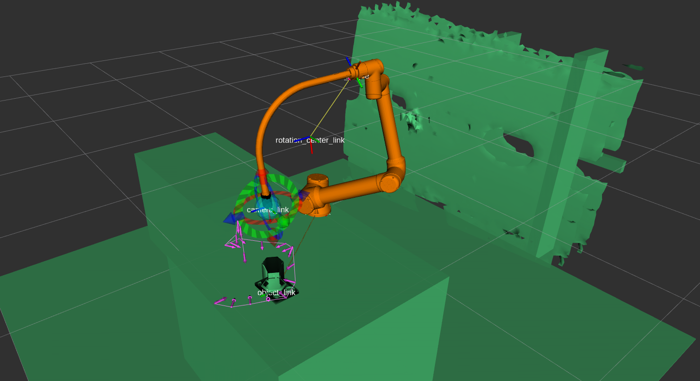

<!--
SPDX-FileCopyrightText: 2024 German Aerospace Center <adrian.ricardezortigosa@dlr.de>

SPDX-License-Identifier: MIT
-->

# FuTaMa2 Project
## (Fuel Tank Maintenance 2)

The aim of this project is to provide the [Robot-Assisted-Inspection-and-Repair](https://wiki.dlr.de/display/MO/Robot.Assisted+Repair) team of the [German Space Center (DLR) - Maintenance, Repair and Overhaul Institute (MO)](https://www.dlr.de/en/mo) and the community of robotic inspection using a set of hardware and software ([ROS2](https://docs.ros.org/en/jazzy/Installation.html)) tools for addressing the challenges of manual and automatic inspection methods performed by the integrated system: UR10e robotic arm + Eeloscope2 (sucessor of [Eeloscope1](https://www.mdpi.com/2226-4310/8/5/136)), which feature:
- 3 RGB-D cameras Intel Realsense D435 
- 6 LEDs for the cameras' view

Since there exists not much open-source documentation about these topics in robotic inspection, this project was proposed to fill that research gap and to encourage modular and continuous research. The potential contribution to the audience is to enable technology transfer possibilities to other systems.

The use case utilized in this study was the inspection of a aircraft (Boeing 737-700) wing fuel tank.
A research article with the methodology, analysis, approach and results of the experiments is intended to be published soon on the [MDPI Open Access Journal](https://www.mdpi.com/). 

Developed packages of this repo:
1. [futama2_description](futama2_robot/futama2_description/) -> urdf, IP, and controllers setup, robot state publisher, STL, meshes, ...
2. [futama2_moveit_config](futama2_robot/futama2_moveit_config/) -> config for moveit and planning scene
3. [futama2_teleop](futama2_robot/futama2_teleop/) -> demo of manual and automatic teleoperations, foto capturing, higher-level functions for robotic inspection
4. [futama2_utils](futama2_robot/futama2_utils/) -> utilities (so far only one for the moveit planner)

A high-level overview can be graphically summarized with the following picture:


## Table of Contents

- [Preparation and Recommendations](#preparation-and-recommendations)
- [Installation of Packages](#installation-of-packages)
  1. [Realsense-ROS](#1-realsense-ros)
  2. [Moveit2 packages](#2-moveit2)
  3. [Universal Robots](#3-universal-robots)
  4. [Octomap](#4-octomap)
  5. [Spacenav](#5-spacenav)
  6. [FuTaMa2](#7-futama2-from-source)
- [Docker](#docker)
- [Robot Usage](#robot-usage)
- [Maintainers](#maintainers), [Contributing](#contributing) & [License](#license)

## Preparation and Recommendations

- Install the [ROS2 Jazzy](https://docs.ros.org/en/jazzy/Installation.html) distro for [Ubuntu 24.04 LTS Jammy](https://releases.ubuntu.com/jammy/)
- Follow the [ROS System Setup basics](https://wiki.dlr.de/display/MO/ROS+System+Setup) (if you have access to the DLR wiki)
- Generally, on each repo, the main mantainers will explain the installation steps for their package (e.g. usually one needs to [manage dependencies](https://docs.ros.org/en/foxy/Tutorials/Intermediate/Rosdep.html) and maybe other additional steps.

# Installation of Packages

The installation steps mentioned here are only documented based on the user experience of the mantainer, but some are to be included in the dependencies of the futama2_packages for easier installation (such as Moveit2).

## 1. Realsense-ROS

Packages that will manage the connection with the cameras. The model of the cameras [D405]shttps://www.intelrealsense.com/depth-camera-d405/) was tested out ([D435i](https://www.intelrealsense.com/depth-camera-d435i/) posible without using the imu).

Required binaries:

- [Here the instructions](https://github.com/IntelRealSense/librealsense/blob/master/doc/distribution_linux.md#installing-the-packages) for installing the [librealsense](https://github.com/IntelRealSense/librealsense) (SDK) package (coming from ["Step2-Option1-Linux Debian Installation"](https://github.com/IntelRealSense/realsense-ros)), since one could encounter multiple issues if building from source (not recommended).

- Other possible required binary packages to be installed with apt install ros-jazzy-«package_name»: [xacro](https://github.com/ros/xacro/tree/ros2), [diagnostic_updater](https://github.com/ros/diagnostics), [launch_pytest](https://github.com/ros2/launch),...

Building from source:

- The ros2-master branch of the [wrapper](https://github.com/IntelRealSense/realsense-ros), (coming from ["Step3-Option2-Install"](https://github.com/IntelRealSense/realsense-ros)).

- Since the rosdep can't resolve the librealsense installed binaries, it is recommended to build from source the master branch of the [librealsense](https://github.com/IntelRealSense/librealsense/tree/development) package too.

Troubleshooting:
1. Issues [#1225](https://github.com/IntelRealSense/librealsense/issues/1225) and [#10988](https://github.com/IntelRealSense/librealsense/issues/10988) can be avoided by disabling the [Secure Boot](https://wiki.ubuntu.com/UEFI/SecureBoot/DKMS) (only if you present this error, otherwise, ignore this bullet point).

2. Other problems when [building](https://docs.ros.org/en/jazzy/Installation/Alternatives/Ubuntu-Development-Setup.html) might be related to USBs (kernel) or binary installation (debian packages). One can solve them by simply search the log output on the web.

3. Be aware of the manual plug / unplug of the cameras when following the installation steps. Sometimes one might make mistakes and require to start over again.

### Quick camera test

- After proper isntallation, one should be able to open the Realsense Viewer with `realsense-viewer`, which will serve just as an installation checker.
- All documentation about calibration can be found in: [Overview](https://dev.intelrealsense.com/docs/calibration), [Tunning Best Performance](https://dev.intelrealsense.com/docs/tuning-depth-cameras-for-best-performance) (execute the Depth Quality Tool with `rs-depth-quality`), [Self-Calibration](https://dev.intelrealsense.com/docs/self-calibration-for-depth-cameras) (the On-Chip Calibration only considers exstrinsic parameters), and the [Dynamic Calibration Tool](https://www.intel.com/content/www/us/en/download/645988/intel-realsense-d400-series-dynamic-calibration-tool.html) (open with `usr/bin/Intel.Realsense.DynamicCalibrator`).


Troubleshooting:

4. If an error about "GLFW Driver Error" [#8661](https://github.com/IntelRealSense/librealsense/issues/8661) rises when opening the realsense-viewer, restarting the computer can fix this.

### Quick launch test

- After building the workspace, one should now be able to test the main launch file with:

`ros2 launch realsense2_camera rs_launch.py pointcloud.enable:=true align_depth.enable:=true`

and visualize the topics on ```rviz2```. The four most useful topics are:

- /camera/camera/color/camera_info
- /camera/camera/color/image_rect_raw
- /camera/camera/depth/image_rect_raw
- /camera/camera/depth/color/points


For more information please consult the official RealSense [usage](https://github.com/IntelRealSense/realsense-ros?tab=readme-ov-file#usage) section.

## 2. Moveit2
Packages that enable robotic manipulation featuring motion planning, 3D perception, kinematics, etc. Official installation steps [here](https://moveit.picknik.ai/main/doc/tutorials/getting_started/getting_started.html).

Required binaries:
- osqp_vendor, ament-cmake-google-benchmark, stomp, ros_testing

Build from source:
- [Moveit2](https://moveit.ros.org/install-moveit2/source/). If using a separate git directory, the generated packages need to be linked from git directory to the ws: moveit2, moveit_msgs, moveit_resources, moveit_visual_tools, generate_parameter_library.

Dependencies not resolved -> urdfdom and urdfdom_headers are installed automatically but not recognized by moveit. They are not required for the purposes of the futama2 project.

## 3. Universal Robots
ROS2 manipulator drivers for the lightweight UR robotic manipulators.

Required binaries: only the "ur_msgs" package. The rest of the binaries for Jazzy seem to be in "passing" (2023) phase, but it would be better to do it from source.

Build from source: 
- ros2 branch from [moveit_visual_tools](https://github.com/moveit/moveit_visual_tools)
- main branch from [Universal_Robots_ROS2_Driver](https://github.com/UniversalRobots/Universal_Robots_ROS2_Driver.git)
- rolling branch from [Universal_Robots_ROS2_Description](https://github.com/UniversalRobots/Universal_Robots_ROS2_Description)
- master branch from [Universal_Robots_Client_Library](https://github.com/UniversalRobots/Universal_Robots_Client_Library)

Please follow the how-to-setup-the-connection [instructions](https://github.com/DLR-MO/FuTaMa2/blob/emrox_intgr/documents/TCP_IP%20connection_%20UR10e%20-%20External%20PC.pdf) between external computer and the UR10e robot to link and test the hardware.

## 4. Octomap
The [Octomap](https://octomap.github.io/) is an efficient probabilistic 3D Mapping framework Based on [Octrees](https://en.wikipedia.org/wiki/Octree). This stack helps for mapping/voxelizing the environment, which helps for the obstacle avoidance functionality when performing the motion planning from Moveit2.

Required binaries:
- octomap, octomap-ros, octomap-server, octomap-mapping, octomap-msgs, octomap-rviz-plugins

## 5. Spacenav
[Package](https://index.ros.org/p/spacenav/) required to control de 6 DoF [Spacemouse](https://3dconnexion.com/de/product/spacemouse-compact/).

Required binaries: spacenav
- Quick test: Visualize the topics by running the node with `ros2 run spacenav spacenav_node` 

## Docker

Will be done in the coming weeks. The installation steps were already followed and they work, but a docker and a .repos file can be added to enable an easier installation. TODO

# Robot Usage

## Hardware Preparation
The setup shown in [this](#futama2-project) diagram is needed for the robot to work properly (for mock and real environments). If the spacemouse is not available, the robot can still be operational with the keyboard, but the foto capture becomes trickier. The best is to have the complete setup.

## Main Commands 

The robot is configured by default to use the join_trajectory_controller (Mode T on the keyboard_node terminal). Move the visual marker of the Moveit Motion Planning plugin in Rviz and press the "Plan & Execute" button before changing to Cartesian mode (C on the second terminal). Mode change is also possible using the buttons of the simple spacemouse (not the new versions at the moment).

First of all, set the initial positions in: futama2_description/config/initial_positions.yaml. Currently, there are two which were found suitable for wing inspection and auto oip object inspection.

### Experiment 1 - Mock Hardware Motion Planning & Teleoperation

To quickly test description, planning scene, and locomotion components:
Two terminals:
- `ros2 launch futama2_teleop teleop_demo.launch.py mode:=mock insp_mode:=manual spacemouse:=true`
- `ros2 run futama2_teleop keyboard_node`

Change `spacemouse:=false` if keyboard is used instead.

TODO ADD PICTURE MOCK HARDWARE NO CAMERA, USED THIS ONE INSTEAD:


### Experiment 2 - Real Hardware Motion Planning & Teleoperation

Three terminals:
- `ros2 launch futama2_teleop teleop_demo.launch.py mode:=real insp_mode:=manual spacemouse:=true camera_mdl:=d435` (Please note that with each launch, the program of the teach pendant of the ur10e needs to restarted)
- `ros2 run futama2_teleop keyboard_node`
- `ros2 param set /camera/camera depth_module.enable_auto_exposure true`

Add the `multicam:=true` argument when using the three cameras.

Add the `octomap:=true` if voxelization for motion planning obstacle avoidance is required.

Change `spacemouse:=false` if keyboard is used instead.

Additional terminal for foto capturing ("screenshots") function by by pressing both side buttons of the spacemouse. If the spacemouse is not available, this function has to be simulated by publishing the following to the /spacenav/joy topic:
- `ros2 topic pub --once /spacenav/joy sensor_msgs/Joy \ '{ header: { stamp: 'now', frame_id: "realsense_center_link"}, axes: [0.0, 0.0, 0.0, 0.0, 0.0, 0.0], buttons: [1, 1]}'`
- `ros2 topic pub --once /spacenav/joy sensor_msgs/Joy \ '{ header: { stamp: 'now', frame_id: "realsense_center_link"}, axes: [0.0, 0.0, 0.0, 0.0, 0.0, 0.0], buttons: [0, 0]}'`
- The picture should be now saved then in your workspace or current directory.


### Experiment 3. OIP Auto Inspection Planner

This is a short demo of an automatic inspection based on the [OIP inspection planner](https://gitlab.dlr.de/mo-repo/rar/inspection-path-planner) developed in DLR.

- `ros2 launch futama2_teleop teleop_demo.py mode:=mock insp_mode:=auto_oip`

Change `mode:=real` if using the real robot instead.

Add the `octomap:=true` if voxelization for motion planning obstacle avoidance is required.

Add the `multicam:=true` argument when using the three cameras to inspect the object.



## 3D reconstruction

In order to make a 3D reconstruction of the inspected object following the manual or automated inspection [experiments](#robot-usage), one requires the use a [rosbag](https://docs.ros.org/en/jazzy/Tutorials/Beginner-CLI-Tools/Recording-And-Playing-Back-Data/Recording-And-Playing-Back-Data.html) with the following topics recorded:

- «each camera prefix»/color/image_rect_raw
- «each camera prefix»/depth/color/points of each camera
- «each camera prefix»/depth/camera_info of each camera
- /tf
- /tf_static
- /monitored_planning_scene
- /robot_description

Once the rosbag is stored, it can be used as the input for the already published [Vinspect](https://github.com/DLR-MO/vinspect) package. Example:


## Further Troubleshooting 

- Motion Planner not working: if you tried to change the controller to all_controller (scaled_joint_trajectory_controller), and the robot still doesn't move, it is better to cancel all processes (even from the UR surface) and start from scratch to avoid dangerous robot jumps between each aggresive movement.

- Problem with: https://github.com/moveit/moveit2/issues/1049 when launching main command (no moveitplanner appearing, alphanumeric problem with ubuntu), solution: ```export LC_NUMERIC="en_US.UTF-8"```. If the error persists, repeat the [installation steps](#2-moveit2) for the moveit packages.

# Maintainers

- Adrian Ricardez Ortigosa adrian.ricardezortigosa@dlr.de
- Dr. Marc Bestmann marc.bestmann@dlr.de

# Contributing

If you’re interested in contributing to the FuTaMa2 project, there are several ways to get involved. Development of the project takes place on the official [GitHub repository](https://github.com/DLR-MO/futama2). There, you can submit bug reports, feature requests, and pull requests. Even and especially when in doubt, feel free to open an issue with a question. Contributions of all types are welcome, and the development team is happy to provide guidance and support for new contributors.

Additionally, the robot-assisted-repair@dlr.de mailing list is available for discussion and support related to the project.

# License

This work is licensed under multiple licenses:

    All original source code, configuration, and documentation is licensed under MIT.

    The code borrowed is licensed under Apache-2.0.

For more accurate information, check the individual files.